# Guía de Implementación Enterprise: Sistema RAG de Alta Precisión para Entornos Industriales e I+D

Esta guía técnica proporciona el paso a paso completo para diseñar, implementar y llevar a producción un sistema de **Retrieval-Augmented Generation (RAG) de Grado Enterprise** para una compañía industrial con decenas de proyectos de I+D activos, documentación compleja de desarrollo de productos (planos, hojas de especificaciones, PRDs) y manuales operativos de líneas de producción en tiempo real.

Tomando como referencia los fundamentos de **arquitectura, indexación avanzada, técnicas de retrieval y despliegue en producción** detallados en el **MÓDULO 9**, esta guía adapta estos conceptos a los retos particulares del sector industrial: alta criticidad ante alucinaciones (riesgo de daños físicos o fallos de manufactura), asimetría semántica extrema y coexistencia de múltiples formatos de datos y perfiles de usuario.

---

## Índice General

1. [Evaluación del Desafío y Arquitectura de Referencia](#1-evaluación-del-desafío-y-arquitectura-de-referencia)
2. [Fase 1: Ingestión Avanzada y Chunking Jerárquico Estratégico](#2-fase-1-ingestión-avanzada-y-chunking-jerárquico-estratégico)
3. [Fase 2: Enriquecimiento de Metadatos y Diseño del Índice Vectorial](#3-fase-2-enriquecimiento-de-metadatos-y-diseño-del-índice-vectorial)
4. [Fase 3: Canalización de Retrieval Avanzado e Híbrido](#4-fase-3-canalización-de-retrieval-avanzado-e-híbrido)
5. [Fase 4: Orquestación Agéntica y Generación Grounded](#5-fase-4-orquestación-agéntica-y-generación-grounded)
6. [Fase 5: Despliegue en Producción, Caching Semántico e Indexación Incremental](#6-fase-5-despliegue-en-producción-caching-semántico-e-indexación-incremental)
7. [Fase 6: Framework de Evaluación Automatizada con RAGAS](#7-fase-6-framework-de-evaluación-automatizada-con-ragas)

---

## 1. Evaluación del Desafío y Arquitectura de Referencia

### 1.1 Por qué falla el "Naive RAG" en el Entorno Industrial

Un pipeline RAG convencional (cargar PDF con un splitter simple de caracteres fijos, embeber con un modelo genérico y buscar el Top-K similar por Coseno) fallará catastróficamente en este escenario por tres razones de negocio:

1. **La "Gran Confusión de Proyectos":** Si un ingeniero de I+D pregunta por la resistencia de presión de un polímero en el *Proyecto Helios (Fase de Diseño V2)*, un buscador puramente semántico podría devolver las especificaciones del *Proyecto Helios (Prototipo V1)* o del *Proyecto Ares*, ya que los términos técnicos son sumamente afines. Esto generaría piezas fuera de tolerancia en la planta.
2. **Tablas e Información Estructural:** Los manuales de máquinas industriales y los PRDs de desarrollo de productos están llenos de tablas con dimensiones, torques y tolerancias. El chunking ciego rompe las tablas de datos, convirtiendo filas y columnas en sopa de texto incomprensible para el embedding.
3. **El Dificultoso Vocabulario de Planta vs. Oficina:** Un operario en la línea de montaje puede ingresar una consulta de urgencia como: *"Alarma E-104 extrusora 3"*. Un modelo de embedding denso no sabrá qué hacer con "E-104" o "3", mientras que un motor de búsqueda por palabras clave clásica (BM25) recuperará la sección exacta de resolución de alarmas pero perderá la capacidad de razonar semánticamente si el usuario describe el síntoma en lugar del código.

### 1.2 Arquitectura Propuesta: Agentic RAG Modular

Para solucionar esto, proponemos un sistema **Modular y Agéntico de RAG** basado en la siguiente arquitectura:

```mermaid
graph TD
    %% Ingestion Flow (Offline)
    subgraph Ingestión [Fase Offline: Ingestión e Indexación]
        Docs[Manuales de Producción, PDFs de I+D, Specs y PRDs] --> Parser[LlamaParse / Unstructured.io]
        Parser --> Markdown[Documentos Estructurados en MD]
        Markdown --> ChunkSplitter{Estrategia de Chunking}
        ChunkSplitter -->|Estructura & Padres| DocStore[(Parent Store: Redis / Postgres)]
        ChunkSplitter -->|Hijos & Sub-chunks| Embedding[Model: BAAI/bge-m3 o Cohere Embed v3]
        Embedding --> VectorDB[(Vector DB: Qdrant / pgvector)]
    end

    %% User Search Flow (Online)
    subgraph Inferencia [Fase Online: Query Time]
        User([Usuario: Operario / Ingeniero I+D]) --> Query[Consulta del Usuario]
        Query --> Cache{Semantic Cache: Redis}
        Cache -->|Hit >= 0.95| ReturnCache[Respuesta Instantánea]
        Cache -->|Miss| Router[Agente Router: LLM Clasificador]
        
        Router -->|Consulta Técnica/Conceptual| Trans[Query Transformation: Multi-Query / HyDE]
        Router -->|Consulta de Alarmas/Manuales| Keyword[Sparse Retrieval: BM25]
        
        Trans --> Semantic[Dense Retrieval: Vector DB]
        
        Semantic --> Fusion[Fusión RRF + Reranker: Cohere Rerank]
        Keyword --> Fusion
        
        Fusion --> Hydrate[Hidratador: Recuperar Chunks Padres de DocStore]
        Hydrate --> Compress[Contextual Compression: LLMLingua / RoBERTa]
        Compress --> Prompt[Prompt Augmentado + Citación de Fuentes]
        Prompt --> LLM[Generador: GPT-4o / Claude Sonnet]
        LLM --> Response[Respuesta Final con Citas Verificables & Bounding Boxes]
        Response --> CacheRegister[Registrar en Caché]
        Response --> User
    end
    
    style Ingestión fill:#1e1e24,stroke:#3a3a4a,color:#ffffff
    style Inferencia fill:#111625,stroke:#232d4b,color:#ffffff
    style Cache fill:#d4af37,stroke:#9a7b1c,color:#000000
```



---

## 2. Fase 1: Ingestión Avanzada y Chunking Jerárquico Estratégico

### 2.1 Parsing Avanzado de Documentos de Ingeniería

Los archivos técnicos de la empresa (Planos PDF, Manuales de Maquinaria y Reportes de I+D) no pueden procesarse con lectores estándar de texto plano como `PyPDFLoader` debido al contenido tabular y gráfico.

* **Recomendación Enterprise:** Usar **LlamaParse** en combinación con **Unstructured.io**. LlamaParse expone una API optimizada que convierte tablas densas de PDF a formato Markdown limpio y preserva la jerarquía visual de los encabezados (H1, H2, H3).
* **Tratamiento de Imágenes:** Las figuras de líneas de producción o esquemas de ensamble se extraen con sus coordenadas espaciales (**Bounding Boxes**) y se pre-procesan usando un modelo multimodal (como GPT-4o-mini o Claude Haiku) para generar una descripción textual enriquecida que se añade como metadato al chunk correspondiente.

### 2.2 Estrategia de Chunking Jerárquico (Parent-Child)

Para resolver la tensión entre una búsqueda de alta precisión semántica (que prefiere chunks pequeños de texto para no diluir el embedding) y una generación coherente por parte del LLM (que requiere contexto circundante amplio para comprender limitaciones o advertencias físicas), implementamos una estrategia **Parent-Child**:

1. **Chunks Padres (Parent):** Segmentos lógicos de **1024 a 2048 tokens**, divididos respetando la estructura física del documento (por ejemplo, secciones completas de manuales o secciones lógicas de un PRD).
2. **Chunks Hijos (Child):** Fragmentos altamente específicos de **128 a 256 tokens** generados a partir de cada chunk padre, con un **overlap del 15%** para asegurar la preservación del contexto transicional en las fronteras de corte.

```
┌─────────────────────────────────────────────────────────────────────────────┐
│                            CHUNK PADRE (1024 Tokens)                        │
│ "Sección 4.2: Calibración de la Válvula Principal de Extrusión. [...]"       │
└─────────────────────────────────────────────────────────────────────────────┘
       │                                │                                │
       ▼                                ▼                                ▼
┌──────────────┐                 ┌──────────────┐                 ┌──────────────┐
│  Hijo 1 (128)│  ◄── Overlap ──►│  Hijo 2 (128)│  ◄── Overlap ──►│  Hijo 3 (128)│
│ "Torque: 45Nm│                 │ "Temp: 210°C │                 │ "Material:   │
│ válvula ext."│                 │ recomendado" │                 │ Polietileno" │
└──────────────┘                 └──────────────┘                 └──────────────┘
       │                                │                                │
       ▼ (Vectorizado)                  ▼ (Vectorizado)                  ▼ (Vectorizado)
 [Vector 1, 3072d]                [Vector 2, 3072d]                [Vector 3, 3072d]
```

### 2.3 Implementación Práctica del Pipeline de Ingestión

A continuación se muestra el script de Python que implementa esta estrategia desacoplada utilizando `MultiVectorRetriever` de LangChain.

```python
import uuid
from langchain.retrievers.multi_vector import MultiVectorRetriever
from langchain.storage import LocalFileStore
from langchain_community.vectorstores import Qdrant
from langchain_openai import OpenAIEmbeddings
from langchain_text_splitters import RecursiveCharacterTextSplitter
from langchain_core.documents import Document
from qdrant_client import QdrantClient

# 1. Inicialización de base de datos vectorial y almacenamiento KV para Padres
client = QdrantClient(path="./qdrant_db")
embeddings = OpenAIEmbeddings(model="text-embedding-3-large") # 3072 dimensiones

vectorstore = Qdrant(
    client=client,
    collection_name="industrial_hijos",
    embeddings=embeddings
)

# El DocStore guarda los chunks padres completos. En producción, usar Redis o PostgreSQL
parent_store = LocalFileStore("./parent_chunks_store")
id_key = "parent_id"

retriever = MultiVectorRetriever(
    vectorstore=vectorstore,
    byte_store=parent_store,
    id_key=id_key,
)

# 2. Definición del Splitter Jerárquico
parent_splitter = RecursiveCharacterTextSplitter(chunk_size=1500, chunk_overlap=150)
child_splitter = RecursiveCharacterTextSplitter(chunk_size=200, chunk_overlap=30)

def ingest_document(raw_text: str, filename: str, metadata: dict):
    # Generar chunks padres
    parent_docs = parent_splitter.create_documents(
        texts=[raw_text],
        metadatas=[{"source": filename, **metadata}]
    )
    
    parent_ids = [str(uuid.uuid4()) for _ in parent_docs]
    child_docs = []
    
    for i, p_doc in enumerate(parent_docs):
        p_id = parent_ids[i]
        # Generar sub-chunks (hijos)
        sub_docs = child_splitter.split_documents([p_doc])
        for s_doc in sub_docs:
            s_doc.metadata[id_key] = p_id  # Enlazar hijo -> padre
            s_doc.metadata["source"] = filename
            s_doc.metadata["project"] = metadata.get("project", "common")
            s_doc.metadata["doc_type"] = metadata.get("doc_type", "manual")
        child_docs.extend(sub_docs)
        
    # Indexar hijos en la base vectorial (búsqueda rápida)
    retriever.vectorstore.add_documents(child_docs)
    
    # Almacenar padres en el almacenamiento persistente (contexto rico para el LLM)
    # Convertimos los documentos padres a bytes para el backend persistente
    parent_kv_pairs = []
    for p_id, p_doc in zip(parent_ids, parent_docs):
        # Serialización simple
        parent_kv_pairs.append((p_id, p_doc.page_content.encode('utf-8')))
        
    retriever.docstore.mset(parent_kv_pairs)
    print(f"Indexados con éxito: {len(parent_docs)} padres y {len(child_docs)} hijos para {filename}.")
```

---

## 3. Fase 2: Enriquecimiento de Metadatos y Diseño del Índice Vectorial

La búsqueda vectorial ingenua sin pre-filtrado determinista es una de las mayores causas de fallos en producción para empresas multiproyectos.

### 3.1 Esquema de Enriquecimiento de Metadatos

Cada chunk de texto debe ser enriquecido de manera automática durante la ingesta con un payload de metadatos estrictamente tipado. Esto se logra mediante pipelines automatizados usando llamadas a modelos de extracción de metadatos más pequeños (ej. `gpt-4o-mini` con structured outputs).

| Campo del Metadato | Tipo | Propósito | Ejemplo |
| :--- | :--- | :--- | :--- |
| `project_id` | `STRING` | Limita las consultas estrictamente a la documentación de un proyecto de I+D. | `"PRJ-HELIOS-2025"` |
| `product_line` | `STRING` | Permite filtrar por línea de producto o maquinaria específica. | `"EXTRUDER-LINE-3"` |
| `doc_type` | `ENUM` | Permite discriminar la naturaleza jurídica/operativa del documento. | `["PRD", "SOP", "MAINTENANCE_LOG", "PATENT"]` |
| `confidentiality` | `ENUM` | Soporte para Control de Acceso Basado en Roles (RBAC). | `["PUBLIC", "INTERNAL", "RESTRICTED", "TOP_SECRET"]` |
| `version` | `STRING` | Evita recuperar especificaciones descontinuadas de versiones previas. | `"V2.1.0"` |
| `creation_timestamp`| `INTEGER`| Ordenación y obsolescencia temporal. | `1779237600` |

### 3.2 Pre-filtrado vs. Post-filtrado en Vector DBs

* **Post-filtrado (No usar en producción):** El motor recupera los Top-K vectores más similares del universo completo y luego descarta aquellos que no cumplen con las reglas.
  * *Peligro:* Si buscas información del *Proyecto Helios* y los primeros 100 resultados más similares pertenecen semánticamente al *Proyecto Ares*, tras aplicar el filtro te quedarás con **0 documentos**, causando que el LLM responda "No poseo información".
* **Pre-filtrado (Estándar Enterprise):** La base de datos vectorial utiliza estructuras de indexación mixtas (por ejemplo, índices invertidos o de mapa de bits combinados con grafos HNSW). El filtro se aplica **antes** de calcular las distancias vectoriales, limitando la búsqueda HNSW únicamente a la vecindad de nodos que cumplen la condición.

```python
# Ejemplo de consulta con Pre-filtrado estricto en Qdrant a través de LangChain
from qdrant_client.http import models as rest_models

def query_with_strict_rbac(query_text: str, user_project: str, user_clearance: str):
    # Creamos un filtro booleano determinista
    qdrant_filter = rest_models.Filter(
        must=[
            rest_models.FieldCondition(
                key="metadata.project",
                match=rest_models.MatchValue(value=user_project)
            ),
            rest_models.FieldCondition(
                key="metadata.confidentiality",
                # Un usuario solo puede acceder a niveles iguales o inferiores a su clearance
                match=rest_models.MatchValue(value=user_clearance)
            )
        ]
    )
    
    # Realizar búsqueda espacial filtrada antes del cálculo semántico
    results = vectorstore.similarity_search(
        query=query_text,
        k=5,
        filter=qdrant_filter
    )
    return results
```

---

## 4. Fase 3: Canalización de Retrieval Avanzado e Híbrido

### 4.1 Búsqueda Híbrida (Dense + Sparse)

En el ámbito industrial, la combinación de búsqueda vectorial e indexación invertida léxica es innegociable.

* **Búsqueda Vectorial Densa:** Excelente para conceptos abstractos como *"método para mejorar la elasticidad térmica del polímero"*.
* **Búsqueda Léxica Dispersa (BM25):** Esencial para códigos exactos de partes físicas o alarmas como `"VALV-XJ900"` o `"ERR-404"`.

Combinamos ambas listas de resultados mediante **Reciprocal Rank Fusion (RRF)**. Este método no depende de escalas de puntuación dispares de los diferentes algoritmos, sino únicamente de la posición relativa de los documentos en cada lista ordenada.

```python
def reciprocal_rank_fusion(dense_rank: list, sparse_rank: list, k: int = 60) -> list:
    """
    Fusiona dos listas ordenadas de identificadores usando RRF.
    Cada lista contiene tuplas (doc_id, score_original) ordenadas de mejor a peor.
    """
    rrf_scores = {}
    
    # Procesar resultados del buscador vectorial denso
    for rank, (doc_id, _) in enumerate(dense_rank, start=1):
        rrf_scores[doc_id] = rrf_scores.get(doc_id, 0.0) + 1.0 / (k + rank)
        
    # Procesar resultados de BM25
    for rank, (doc_id, _) in enumerate(sparse_rank, start=1):
        rrf_scores[doc_id] = rrf_scores.get(doc_id, 0.0) + 1.0 / (k + rank)
        
    # Ordenar los identificadores fusionados de mayor a menor RRF Score
    fused_sorted = sorted(rrf_scores.items(), key=lambda x: x[1], reverse=True)
    return fused_sorted
```

### 4.2 Query Transformation: HyDE + Multi-Query

Antes de buscar, la consulta del usuario debe optimizarse mediante dos técnicas ejecutadas concurrentemente:

1. **HyDE (Hypothetical Document Embeddings):** Útil para ingenieros de I+D. Un LLM rápido (como `gpt-4o-mini`) genera una respuesta teórica ideal a la consulta del usuario. Se genera el embedding de esa respuesta hipotética y se lanza la búsqueda. Esto alinea de inmediato el espacio vectorial de la consulta con el de las patentes y papers almacenados.
2. **Multi-Query:** Se generan 3 variaciones de la pregunta con terminología y sinónimos del ámbito industrial para mitigar problemas de consulta sesgada del usuario.

### 4.3 Re-ranking con Cross-Encoder

Los modelos de embedding tradicionales calculan los vectores de manera aislada (Bi-encoders). Esto es ágil para buscar en colecciones millonarias, pero es impreciso con matices sutiles.

Implementamos un pipeline de dos etapas:

1. **Fase de Recuperación:** Recuperar el **Top-50** usando Búsqueda Híbrida (rápido y con alta sensibilidad / Recall).
2. **Fase de Re-ranking:** Pasar la consulta del usuario y los 50 documentos juntos a través de un modelo de re-ranking **Cross-Encoder** (como `cohere-rerank-v3` o un modelo local `BAAI/bge-reranker-large`). El mecanismo de auto-atención del Transformer evalúa la interacción directa palabra por palabra entre la consulta y el documento, reordenando los resultados para entregar un **Top-5** de altísima precisión (Precision@5).

```python
# Integración de Reranking en LangChain
from langchain.retrievers import ContextualCompressionRetriever
from langchain_cohere import CohereRerank

# Inicializar Reranker comercial de Cohere (o usar SentenceTransformers localmente)
cohere_compressor = CohereRerank(model="rerank-multilingual-v3.0", top_n=5)

# Crear el recuperador avanzado
advanced_retriever = ContextualCompressionRetriever(
    base_compressor=cohere_compressor,
    base_retriever=retriever  # Nuestro MultiVectorRetriever configurado en la Fase 1
)
```

---

## 5. Fase 4: Orquestación Agéntica y Generación Grounded

### 5.1 Enrutamiento Inteligente (Agentic Routing)

No todas las preguntas de los usuarios de la empresa deben resolverse por el mismo camino. Un operario pidiendo auxilio sobre una alarma en vivo requiere una velocidad óptima, mientras que un investigador de I+D requiere un análisis exhaustivo cruzando múltiples proyectos de patentes.

Implementamos un agente enrutador basado en llamadas guiadas por esquemas JSON:

```
                  ┌─────────────────────────┐
                  │   Consulta de Usuario   │
                  └────────────┬────────────┘
                               │
                      [Agente Enrutador]
                               │
        ┌──────────────────────┼──────────────────────┐
        ▼                      ▼                      ▼
  [Línea Producción]        [I+D / Patentes]        [Especificaciones]
  - BM25 Rápido             - HyDE Activo           - SQL / Tablas
  - Caching Semántico       - Reranking Profundo    - Filtro strict PRD
  - Latencia < 500ms        - Latencia < 3.0s       - Latencia < 1.5s
```

### 5.2 Compresión Contextual (Mitigación de "Lost in the Middle")

Una vez recuperado el Top-5 de chunks padres (que equivalen a unas 5,000 palabras de contexto), inyectarlos directamente en el prompt del LLM genera altos costes y diluye la atención del modelo, haciendo que ignore advertencias ubicadas a mitad del prompt.

* **Solución:** Usar **LLMLingua** o un compresor de texto basado en perplejidad de lenguaje. Esto analiza los fragmentos recuperados y elimina pronombres, artículos redundantes e información secundaria que no aporta al grounding de la pregunta, logrando reducciones de tamaño de prompt de hasta un **60%** sin pérdida de información técnica clave.

### 5.3 Prompt Engineering Grounded y Citación de Fuentes

Para erradicar la invención de datos en ingeniería, estructuramos un prompt extremadamente restrictivo. El LLM debe comportarse como un **"evaluador lógico de evidencias"** y no como un escritor creativo.

```python
from langchain_openai import ChatOpenAI
from langchain_core.prompts import ChatPromptTemplate

llm_generator = ChatOpenAI(model="gpt-4o", temperature=0.0) # Temperatura cero absoluta

SYSTEM_PROMPT = """Eres el Asistente AI Oficial de Ingeniería y Seguridad de la Compañía.
Tu rol es responder la pregunta técnica utilizando ÚNICAMENTE los fragmentos de contexto proporcionados abajo.

REGLAS CRÍTICAS DE CONCORDANCIA Y SEGURIDAD:
1. Si los fragmentos de contexto no contienen la respuesta exacta a la pregunta, debes responder de forma unívoca: "INFORMACIÓN NO DISPONIBLE EN EL CORPUS DE SEGURIDAD". No intentes deducir, alucinar o usar conocimiento externo.
2. Si detectas contradicciones de especificaciones entre dos proyectos de I+D en el contexto, indícalo detalladamente explicitando el identificador del proyecto.
3. Cada afirmación de tu respuesta debe ir respaldada con una cita inline que contenga el ID del documento y la página al final de la oración, por ejemplo: [DOC-XJ900, pág. 14].

CONTEXTO RECUPERADO:
{context}

PREGUNTA DEL USUARIO:
{question}

RESPUESTA TÉCNICA FUNDAMENTADA:"""

prompt_template = ChatPromptTemplate.from_template(SYSTEM_PROMPT)
```

---

## 6. Fase 5: Despliegue en Producción, Caching Semántico e Indexación Incremental

### 6.1 Caching Semántico en Planta (Redis / GPTCache)

En entornos de manufactura real, el personal suele repetir consultas de solución de problemas (por ejemplo, operarios de diferentes turnos lidiando con fallos mecánicos recurrentes).

Para evitar la sobrecarga económica de llamadas a APIs y, sobre todo, para bajar la latencia de respuesta de **3.5 segundos** a escasos **150 milisegundos**, se instala una **Caché Semántica** usando Redis Vector Search:

```python
# Ejemplo conceptual de flujo de caché semántica
async def get_response_with_semantic_cache(user_query: str, threshold: float = 0.94):
    # 1. Obtener embedding de la consulta del usuario
    query_vector = await get_embedding_async(user_query)
    
    # 2. Buscar en la colección de caché de Redis Vector
    cache_hits = await redis_vector_db.similarity_search(query_vector, limit=1)
    
    if cache_hits and cache_hits[0].score >= threshold:
        # Se encontró una pregunta semánticamente idéntica en el pasado
        return {
            "response": cache_hits[0].cached_response,
            "source": "semantic_cache_hit",
            "confidence": cache_hits[0].score
        }
        
    # 3. Cache Miss: Ejecutar pipeline completo de RAG
    rag_response = await run_full_rag_pipeline(user_query, query_vector)
    
    # 4. Registrar en la Caché Semántica para futuras consultas
    await redis_vector_db.insert(
        vector=query_vector,
        query_text=user_query,
        response=rag_response
    )
    
    return {
        "response": rag_response,
        "source": "llm_inference"
    }
```

### 6.2 Pipeline de Actualización Incremental (Record Manager Ledger)

Re-indexar millones de vectores de especificaciones industriales todas las semanas es económicamente insostenible y genera downtime en el servicio. Implementamos una **indexación incremental con ledger de base de datos relacional**.

El `Record Manager` calcula un hash criptográfico SHA-256 de cada documento origen. Cuando el proceso de sincronización corre en segundo plano:

* Si el archivo es **nuevo**: Genera chunks, vectoriza y escribe.
* Si el archivo **existe pero el hash cambió**: Borra selectivamente (tombstoning) los vectores anteriores en la base vectorial usando metadatos de ID y re-indexa los nuevos.
* Si el archivo **ya no existe en la fuente original**: Limpia y purga todos los vectores huérfanos.

```python
from langchain.indexes import index, SQLRecordManager
from langchain_community.document_loaders import DirectoryLoader

def run_nightly_incremental_sync(directory_path: str):
    # Cargar documentos del directorio compartido de ingeniería
    loader = DirectoryLoader(directory_path, glob="**/*.pdf")
    documents = loader.load()
    
    # Base de datos local SQLite para actuar como Ledger de control de hashes
    record_manager = SQLRecordManager(
        namespace="qdrant/industrial_kb",
        db_url="sqlite:///record_manager_hashes.db"
    )
    record_manager.create_schema()
    
    # Sincronización incremental con borrado full de descontinuados
    stats = index(
        documents,
        record_manager,
        vectorstore,
        cleanup="full",
        source_id_key="source"
    )
    
    print("Reporte de Sincronización Incremental de Planta:")
    print(f"- Chunks Nuevos Indexados: {stats['num_added']}")
    print(f"- Chunks Actualizados: {stats['num_updated']}")
    print(f"- Documentos Obsoletos Purgados: {stats['num_deleted']}")
    print(f"- Chunks Omitidos (Sin cambios): {stats['num_skipped']}")
```

---

## 7. Fase 6: Framework de Evaluación Automatizada con RAGAS

El sistema RAG no puede ponerse en producción sin una validación estadística robusta de no alucinación. Establecemos un pipeline de CI/CD que evalúa el rendimiento utilizando **RAGAS (Retrieval-Augmented Generation Assessment)** como marco de evaluación automatizado "LLM-as-a-Judge".

### 7.1 El Golden Dataset de Validación

Antes del primer despliegue, el equipo de ingeniería de planta y los líderes de I+D definen una suite fija de control de **120 preguntas críticas** estructurada en tres subconjuntos (Seguridad de Planta, Especificaciones Físicas y Patentes I+D). Cada registro del Golden Dataset debe estar estructurado de la siguiente forma:

```json
{
  "question": "¿Cuál es el límite absoluto de torque admisible para el acople de la extrusora Line-3 en el manual V2?",
  "ground_truth": "El límite absoluto de torque admisible para la extrusora Line-3 es de 55 Nm, requiriéndose apagado de emergencia inmediato si se superan los 58 Nm por más de 3 segundos."
}
```

### 7.2 Las 4 Métricas Core de Calibración

En cada pull request o cambio en los pesos del embedding, el sistema corre el dataset contra el pipeline RAG y computa las cuatro métricas clave:

```
                                  ┌───────────────────────────┐
                                  │      PIPELINE RAGAS       │
                                  └─────────────┬─────────────┘
                                                │
                     ┌──────────────────────────┴──────────────────────────┐
                     ▼                                                     ▼
         [Métricas del Retriever]                              [Métricas del Generator]
         
       1. Context Precision (Precision)                      3. Faithfulness (Fidelidad)
       ¿Aparece el chunk con el torque                       ¿La respuesta generada se basa
       de 55 Nm en los primeros lugares?                     ÚNICAMENTE en los chunks? (Cero alucinación)
       
       2. Context Recall (Cobertura)                         4. Answer Relevancy (Relevancia)
       ¿Se recuperó toda la sección técnica                  ¿Responde directamente a la pregunta
       de parada de emergencia?                              sin rodeos conceptuales irrelevantes?
```

### 7.3 Script Completo de Ejecución del Framework RAGAS

```python
from ragas import evaluate
from ragas.metrics import (
    faithfulness,
    answer_relevancy,
    context_precision,
    context_recall,
)
from datasets import Dataset
import pandas as pd

def run_ci_cd_ragas_evaluation(evaluation_results_path: str):
    """
    Simula la ejecución automatizada en Jenkins/GitHub Actions.
    Toma las consultas generadas por el pipeline RAG candidato y las evalúa.
    """
    
    # 1. Cargar el dataset que contiene las respuestas obtenidas por el modelo candidato
    # El archivo 'candidate_predictions.json' debe contener las siguientes columnas:
    # - question: Pregunta original
    # - answer: Respuesta generada por el LLM candidato
    # - contexts: Lista de textos recuperados en ese turno
    # - ground_truth: Respuesta de referencia escrita por los expertos de la empresa
    
    df_eval = pd.read_json("candidate_predictions.json")
    dataset = Dataset.from_pandas(df_eval)
    
    # 2. Lanzar la evaluación estadística profunda usando GPT-4 como Juez Evaluador
    results = evaluate(
        dataset=dataset,
        metrics=[
            faithfulness,
            answer_relevancy,
            context_precision,
            context_recall
        ]
    )
    
    # 3. Guardar resultados y definir políticas de Gatekeeping en CI/CD
    scores = results.scores
    df_scores = pd.DataFrame([scores])
    df_scores.to_csv(evaluation_results_path, index=False)
    
    print("--- RESULTADOS OBTENIDOS POR RAGAS ---")
    print(f"1. Fidelidad (Evitación de alucinaciones): {scores['faithfulness']:.4f}")
    print(f"2. Relevancia de la Respuesta: {scores['answer_relevancy']:.4f}")
    print(f"3. Precisión del Contexto (Retriever): {scores['context_precision']:.4f}")
    print(f"4. Cobertura del Contexto (Recall): {scores['context_recall']:.4f}")
    
    # Política de bloqueo de despliegue (Gatekeeping)
    # Exigimos un 95% de ausencia de alucinación para entornos industriales críticos.
    CRITICAL_HAL_THRESHOLD = 0.95 
    
    if scores['faithfulness'] < CRITICAL_HAL_THRESHOLD:
        print("\n[CRITICAL WARNING] FALLO DE VALIDACIÓN: La fidelidad de las respuestas está por debajo del límite de seguridad.")
        print("El despliegue automático a producción ha sido abortado para evitar alucinaciones en planta.")
        exit(1)
    else:
        print("\n[SUCCESS] VALIDACIÓN COMPLETADA. El pipeline cumple con los estándares de seguridad industrial y I+D.")
        exit(0)
```

---

## Resumen Ejecutivo de Despliegue en 30 Días

Para garantizar el éxito de este proyecto corporativo, se recomienda ejecutar el despliegue en un plan iterativo dividido en 4 semanas de trabajo técnico:

* **Semana 1: Infraestructura y Parsing:** Configuración de `Qdrant` con soporte HNSW e indexación inicial de PDFs usando `LlamaParse`.
* **Semana 2: Chunking y Metadatos:** Configuración del esquema **Parent-Child** y etiquetado automático de los metadatos de los proyectos para garantizar RBAC y pre-filtrado determinista.
* **Semana 3: Optimización del Canal (Retrieval):** Configuración del pipeline de búsqueda híbrida BM25 + Vectorial con RRF y montaje del re-ranker local.
* **Semana 4: Producción y Aseguramiento:** Despliegue de la caché semántica en Redis, automatización del script incremental nocturno y validación final de CI/CD basada en scores RAGAS.
